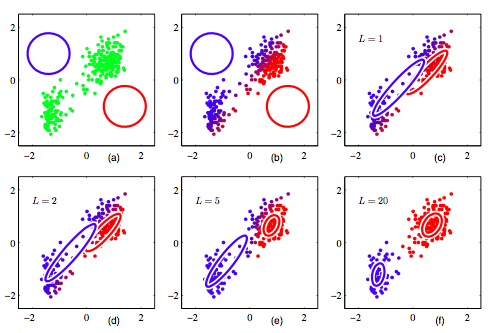
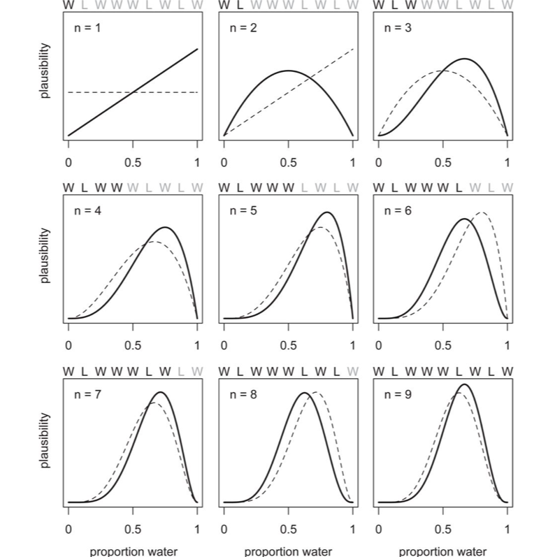
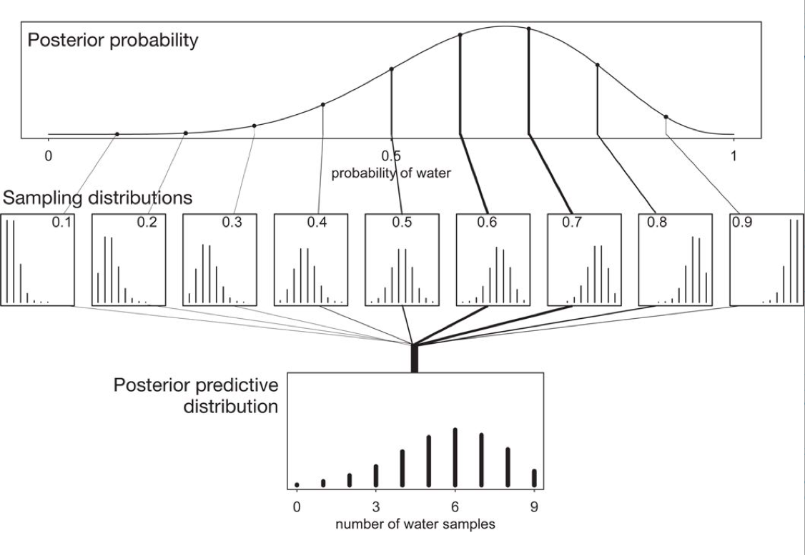
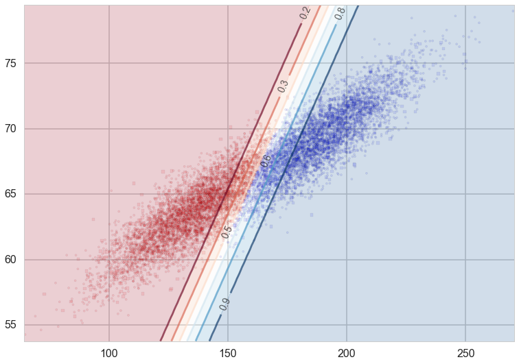
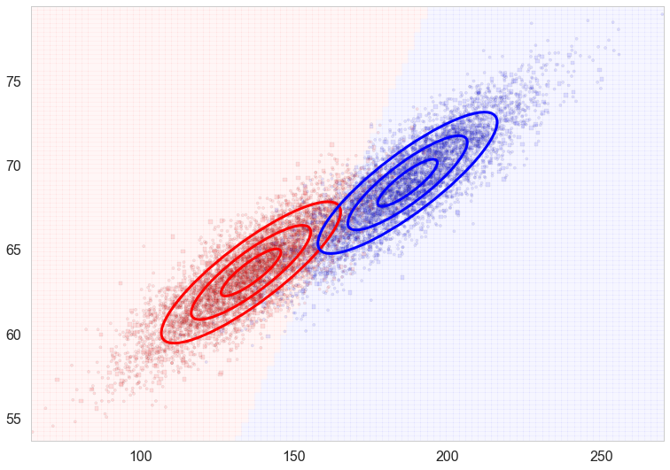
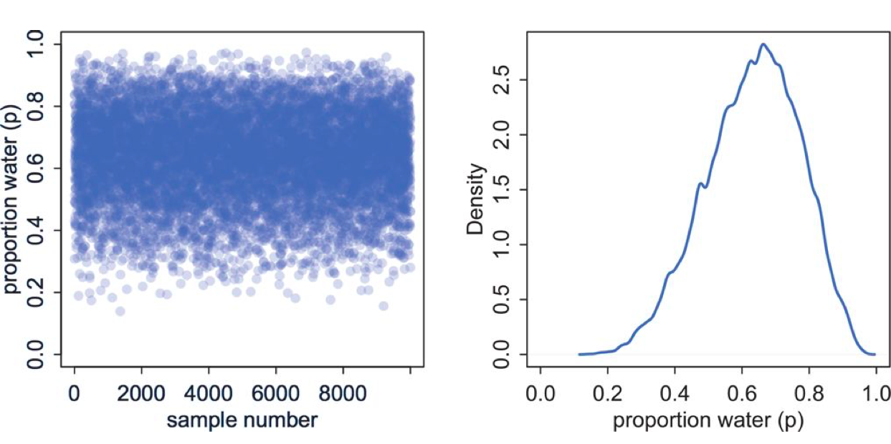
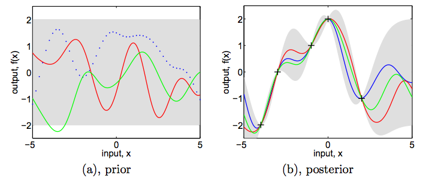
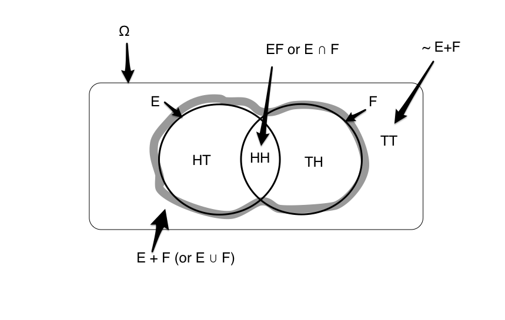

#[fit] AM207

#[fit] [https://am207.github.io/2017/](https://am207.github.io/2017/)

---

#When?

Tuesday 11.30am - 1pm, Lecture. Compulsory to attend. Maxwell Dworkin G115.

Thursday 11.30am - 1pm, Lecture. Compulsory to attend. Maxwell Dworkin G115.

Fridays 11am - 1pm Lab. Compulsory to attend. Pierce 301.

---

#Who

Instructor:

Rahul Dave

TFs:

- Weiwei Pan
- Rafael Martinez Galarza
- Patrick Ohiomoba
- Michael Farrell

---

# Why take this course?

- learn how to think in principled ways of modeling..why..not just how..
- ..using bayesian statistics which is far more natural, and which has applications in almost every field
- understand deeply how and why machine leaning works
- learn generative models so that you can understand NNs, GANs better
- Analyze problems using bayesian approaches

---

- learn how to regularize models
- deal with data computationally large/small and statistically small/large
- learn how to optimize objective functions such as loss functions using Stochastic Gradient Descent and Simulated annealing
- Perform sampling and MCMC to solve a variety of problems
- Learn how and when to use parametric and non-parametric stochastic processes

---

# Why not?

- this is a hard course. you will have to work hard. especially on your own
- you do not have the requisite background
- you are a statistics expert

---

# Modules

- stats review and sampling
- optimization and machine learning; stochastic optimization
- Bayesian concepts and density estimation
- MCMC and other algorithms to obtain posteriors
- Bayesian regression and glms
- Model checking, comparison, and selection
- Time dependent, non-iid models

---

#sampling

(see https://www.lancaster.ac.uk/pg/jamest/Group/index.html for nice brief introductions to some of our concepts)

---

#optimization

(Simulated Annealing, Wikipedia)

---

(Expectation Maximization, Bishop)

---

#Bayesian statistics

Small world:

$$P(\theta \mid D) = \frac{P(D \mid \theta) \times P(\theta)}{P(D)}$$

Big World:

$$P(M \mid D) = \frac{P(D \mid M) \times P(M)}{P(D)}$$

---

#Bayesian Analysis for Higgs

 

---

#Posterior, updated

---

#Posterior Predictive

---

#Machine learning and Generative Models

---

#MCMC

---

#MCMC and HMC

(see at https://www.youtube.com/watch?v=Vv3f0QNWvWQ)

---

---

# Whats up with these counties?

---

# And with these?

---

#Hierarchical Model with regularization

---
#glms

Monks in monastery $$i$$ (indicator $$x_i$$) produce $$y_i$$ manuscripts a day.

Poisson likelihood and logarithmic link

Model:

$$y_i \sim Poisson(\lambda_i)$$

$$log(\lambda_i) = \alpha + \beta x_i$$

---

#dynamical systems

hidden markov models

---

#gaussian processes

nonparametric, prior on functions...

---

#[fit]Concepts running through:

# Hidden Variables
# Marginalizing over nuisance parameters
# Differentiation vs Integration
# Frequentist vs Bayesian
# Generative Models

---

#[fit] Overall concept: Box's Loop

(image from David Blei's paper on hidden variables)

---

# Requirements

- you will need to know how to program numerical python
- you will need to have a background in stats and simple distributions at least although we will review concepts whenever needed. Its better when you are reviewing concepts than learning it for the first time
- you should be comfortable with matrix manipulations and calculus. You should have a passing knowledge of multivariate calculus.

---

#What kind of course?

- grad level course though nothing is really grad level hard
- if you have machine learning background you will make a lot of mental connections.
- i am your emcee; its my job to incorporate info and understanding from various places.
- probably harder than cs181 but simpler than cs281. Ideal in-between course.

---

# Structure of the course

- lectures (2 per week), compulsory
- lab (you will play), compulsory
- homework (every week)
- project-ish homework (every 2-3 weeks)
- final exam (a glorified project-ish homework)
- readings

---

- there will be readings most weeks, some made available a lecture or two ahead
- preliminary notes will made available a lecture or two ahead..you should read these before class
- notes will be updated towards the time of the lecture
- lecture slides will be made available just before or after the lecture

---

- homework will be made available every week after lecture on thursday; is due every week thursday midnight. should take 4-5 hours
- "project" homework is due in 2 weeks after it is announced. should take 8-9 hours
- this means your weekly homework load is about 9-10 hours
- expect another 6-7 hours of reading, including both before and after lecture

---

#Probability

- from symmetry
- from a model, and combining beliefs and data: Bayesian Probability
- from long run frequency

---

- E is the event of getting a heads in a first coin toss, and F is the same for a second coin toss.
- $$\Omega$$ is the set of all possibilities that can happen when you toss two coins: {HH,HT,TH,TT}

---

#Fundamental rules of probability:

1. $$p(X) >=0$$;  probability must be non-negative

2. $$0 ≤ p(X) ≤ 1 \;$$

3. $$p(X)+p(X^-)=1 \;$$ either happen or not happen.

4. $$p(X+Y)=p(X)+p(Y)−p(X,Y) \;$$

---

#Random Variables

**Definition**. A random variable is a mapping

$$ X: \Omega \rightarrow \mathbb{R}$$

that assigns a real number $$X(\omega)$$ to each outcome $$\omega$$.
- $$\Omega$$ is the sample space. Points
- $$\omega$$ in $$\Omega$$ are called sample outcomes, realizations, or elements.
- Subsets of $$\Omega$$ are called Events.

---

- Say $$\omega = HHTTTTHTT$$ then $$X(\omega) = 3$$ if defined as number of heads in the sequence $$\omega$$.
- We will assign a real number P(A) to every event A, called the probability of A.
- We also call P a probability distribution or a probability measure.

---

#Marginals and Conditionals

$$p(X=x_i) = \sum_j p(X=x_i, Y=y_j)$$

$$p(Y = y_j \mid X = x_i) \times p(X=x_i) =  p(X=x_i, Y=y_j).$$

---

#Bayes Theorem

#[fit]$$ p(y\mid x) = \frac{p(x\mid y) \, p(y) }{p(x)} = \frac{p(x\mid y) \, p(y) }{\sum_{y'} p(x,y')} = \frac{p(x\mid y) \, p(y) }{\sum_{y'} p(x\mid y')p(y')}$$

---

Sally Clark, Convicted 1999, murder of her 2 babies.

---

The chance of one random infant dying from SIDS was about 1 in 1,300 during this period in Britain. The estimated odds of a second SIDS death in the same family was much larger, perhaps one in 100.

    p(child 1 dying of sids) = 1/8500
    P(child 2 dying of sids) = 1/100
    p(S2 = both children dying of sids) =  0.000007
    p(notS2 = not both dying of sids) =  0.999993

---

    Data: both children died unexpectedly

Only about 30 children out of 650,000 annual births in England, Scotland, and Wales were known to have been murdered by their mothers. The number of double murders must be much lower, estimated as 10 times less likely.

    p(data | S2) = 1
    p(data | notS2)  =  30/650000	× 1/10 = 0.000005

---

Use Bayes Theorem

$$ p(y\mid x) = \frac{p(x\mid y) \, p(y) }{p(x)} = \frac{p(x\mid y) \, p(y) }{\sum_{y'} p(x,y')} = \frac{p(x\mid y) \, p(y) }{\sum_{y'} p(x\mid y')p(y')}$$

    p(S2 | data) = P(data | S2) P(S2) /(P(data | S2) P(S2) + P(data|notS2)P(notS2))
    = 1*0.000007/(1*0.000007 + 0.000005*0.999993)
    =0.58

Sally Clark spent **3 years** in jail.

Died of acute alchohol intoxication in 2007.

---
